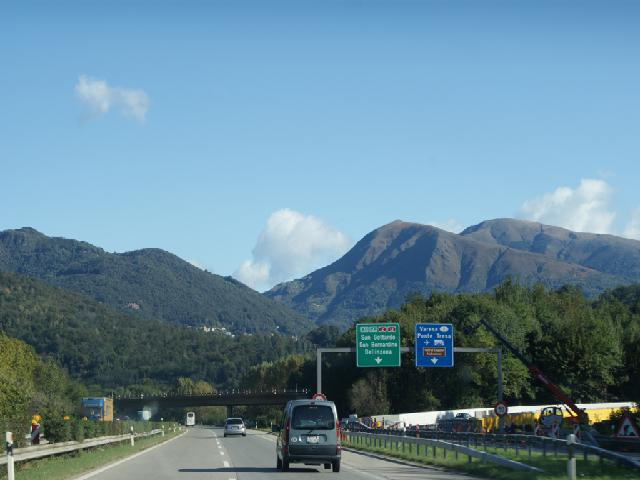
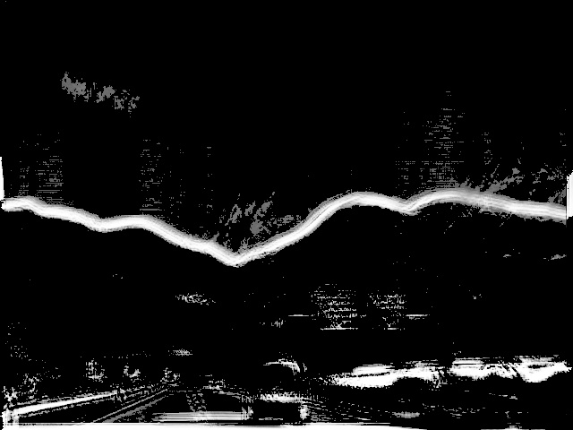

# DCSI
Reproduce the paper  🔥"An Edge-Less Approach to Horizon Line Detection"🔥

The code is used to detect the skyline(the boundary between the sky area and the no-sky area) of the images.First, generate the 16*16 patches as train dataset from the mountain images; Second, train a classifier based on SVM; Third, slide on the test image to get the probability of patches which belong to skyline.

# Brief
* [x] SVM
* [x] data generate
* [x] support train and test

# Environment
* [x] python3.6
* [x] numpy==1.18.1
* [x] opencv==3.4.2
* [x] scikit-learn==0.22.1

# Result

# Cite
@INPROCEEDINGS{7424466,  
author={T. {Ahmad} and G. {Bebis} and M. {Nicolescu} and A. {Nefian} and T. {Fong}},  
booktitle={2015 IEEE 14th International Conference on Machine Learning and Applications (ICMLA)},  
title={An Edge-Less Approach to Horizon Line Detection},   
year={2015},  
volume={},  
number={},  
pages={1095-1102},}
